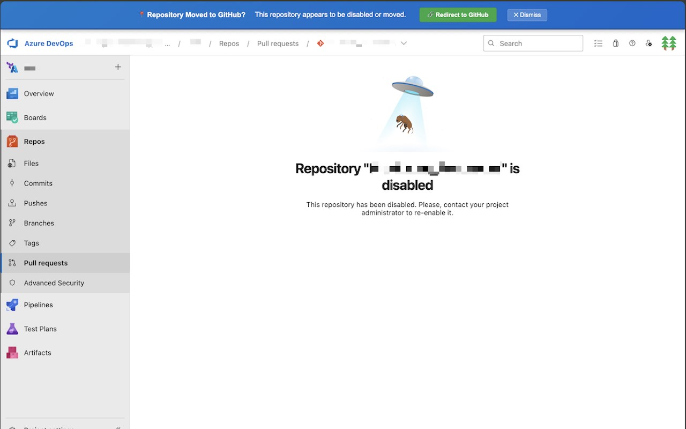

# ADO to GitHub Redirector

A Chrome/Edge browser extension that helps users seamlessly redirect from disabled Azure DevOps Repositories to their corresponding GitHub repositories.

<div align="center">
  
</div>

## 🚀 Overview

When organizations migrate from Azure DevOps Repos to GitHub, the old Azure DevOps URLs often become disabled or inaccessible, leaving users with no information about where the repositories have moved. This extension solves that problem by providing automatic redirection to the corresponding GitHub repositories.

## ✨ Features

- **Automatic Detection**: Detects when you're on an Azure DevOps repository URL
- **Smart Redirection**: Redirects to the corresponding GitHub repository
- **Pull Request Support**: Specifically handles pull request URLs and redirects to GitHub's closed PR search (since migrated PRs are typically closed)
- **Visual Notifications**: Shows banner notifications when disabled repositories are detected
- **One-Click Redirect**: Extension icon click provides immediate redirection for configured organizations
- **Configurable Organizations**: Set custom Azure DevOps and GitHub organization names
- **Exclude Keywords**: Strips configurable prefixes (default: `moved_`) from renamed ADO repository names when building the GitHub URL

## 📋 Prerequisites

- Chrome or Microsoft Edge browser
- Basic knowledge of your organization's Azure DevOps and GitHub organization names

## 🔧 Installation

### From Chrome Web Store / Edge Add-ons

- [Chrome Web Store](https://chromewebstore.google.com/detail/ado-to-github-redirector/cejhgehboelomfolcnfleokalhpmhlhh)
- [Edge Add-ons](https://microsoftedge.microsoft.com/addons/detail/ado-to-github-redirector/mkgaagagpakimpbmkldfekpndgegpfep)

### Manual Installation (Development)

1. Clone or download this repository to your local machine
2. Open Chrome or Edge and navigate to the extensions page:
   - **Chrome**: `chrome://extensions/`
   - **Edge**: `edge://extensions/`
3. Enable "Developer mode" (toggle in the top-right corner)
4. Click "Load unpacked" and select the extension folder
5. The extension should now appear in your browser toolbar

## ⚙️ Configuration

### Initial Setup

1. Click the extension icon in your browser toolbar
2. Enter your organization details:
   - **Azure DevOps Organization**: Your ADO organization name (e.g., `mycompany`)
   - **GitHub Organization**: Your GitHub organization name (e.g., `mycompany-github`)
   - **Exclude Keywords**: Comma-separated prefixes stripped from the ADO repository name (default: `moved_`)
3. Click "Save Settings"

### Example Configuration

```
Azure DevOps Organization: contoso
GitHub Organization: contoso-github
Exclude Keywords: moved_
```

This will redirect URLs like:
- `https://dev.azure.com/contoso/MyProject/_git/MyRepo` → `https://github.com/contoso-github/MyProject-MyRepo`
- `https://dev.azure.com/contoso/MyProject/_git/moved_MyRepo` → `https://github.com/contoso-github/MyProject-MyRepo`

### Exclude Keywords

Some organizations rename ADO repositories after migration instead of archiving them (e.g., `MyRepo` becomes `moved_MyRepo`). The exclude keywords setting strips such prefixes from the repository name before building the GitHub URL, so the redirect still lands on the original repository name. Multiple prefixes can be set as a comma-separated list (e.g., `moved_, archived_`). Leave the field empty to disable stripping.

## 🎯 How It Works

### URL Mapping

The extension follows this mapping pattern:

| Azure DevOps URL | GitHub URL |
|-------------------|------------|
| `https://dev.azure.com/{ADO_ORG}/{PROJECT}/_git/{REPO}` | `https://github.com/{GITHUB_ORG}/{PROJECT}-{REPO}` |
| `https://dev.azure.com/{ADO_ORG}/{PROJECT}/_git/{REPO}/pullrequest/{ID}` | `https://github.com/{GITHUB_ORG}/{PROJECT}-{REPO}/pulls?q=is%3Aclosed+is%3Apr` |

### Pull Request Handling

For pull request URLs, the extension redirects to GitHub's closed pull request search because:
- Migrated pull requests are typically closed in the new repository
- This provides the best chance of finding the corresponding GitHub PR
- The search includes both project and repository names for accuracy

## 🔍 Usage Examples

### Basic Repository Redirect

**From**: `https://dev.azure.com/mycompany/WebApp/_git/Frontend`
**To**: `https://github.com/mycompany-github/WebApp-Frontend`

### Pull Request Redirect

**From**: `https://dev.azure.com/mycompany/WebApp/_git/Frontend/pullrequest/12345`
**To**: `https://github.com/mycompany-github/WebApp-Frontend/pulls?q=is%3Aclosed+is%3Apr`

## 🎨 Visual Features

### Banner Notifications

When the extension detects a disabled repository, it shows a blue banner at the top of the page with:
- Clear messaging about the repository status
- A direct "Redirect to GitHub" button
- Auto-dismiss after 10 seconds

### Extension Icon

- Shows visual feedback when on Azure DevOps repository URLs
- Click for immediate redirection (when configured)
- Provides clear hover tooltips

## 🛠️ Technical Details

### Architecture

- **Manifest Version**: 3 (latest Chrome extension standard)
- **Permissions**: `storage`, `activeTab`, `tabs`
- **Host Permissions**: `dev.azure.com/*`, `github.com/*`

### Files Structure

```
├── manifest.json          # Extension configuration
├── popup.html             # Settings UI
├── popup.js               # Settings management and redirect logic
├── content.js             # Page content analysis and notifications
├── background.js          # URL monitoring and redirection
├── shared.js              # Shared URL conversion and settings logic
├── icon16.png             # Extension icons (16x16)
├── icon32.png             # Extension icons (32x32)
├── icon48.png             # Extension icons (48x48)
└── icon128.png            # Extension icons (128x128)
```

### Compatibility

- ✅ Google Chrome (Manifest V3)
- ✅ Microsoft Edge (Chromium-based)
- ✅ Cross-platform (Windows, macOS, Linux)

## 🔒 Privacy & Security

- **No Data Collection**: The extension does not collect or transmit any personal data
- **Local Storage Only**: All settings are stored locally in your browser
- **Minimal Permissions**: Only requests necessary permissions for core functionality
- **Open Source**: All code is available for review

## 🐛 Troubleshooting

### Extension Not Working

1. **Check Configuration**: Ensure both organization names are correctly set
2. **Reload Extension**: Disable and re-enable the extension
3. **Check URL Pattern**: Verify the Azure DevOps URL contains `/_git/`
4. **Browser Console**: Check for error messages in developer tools

### Common Issues

| Issue | Solution |
|-------|----------|
| Redirect goes to wrong GitHub organization | Double-check GitHub organization name in settings |
| Extension doesn't detect ADO URLs | Ensure URL contains `dev.azure.com` and `/_git/` |
| Banner not showing | Refresh the page after installing extension |

## 🤝 Contributing

Contributions are welcome! Please feel free to submit issues, feature requests, or pull requests.

### Development Setup

1. Clone the repository
2. Make your changes
3. Test in browser with developer mode
4. Submit a pull request

## 📄 License

This project is open source and available under the MIT License.

## 🙏 Acknowledgments

- Inspired by the need to bridge Azure DevOps to GitHub migrations
- Thanks to all organizations making the transition to GitHub
- Built with modern Chrome Extension APIs for reliability

---

**Note**: This extension is designed to help with Azure DevOps to GitHub migrations. Ensure you have the necessary permissions to access both the original Azure DevOps repositories and the target GitHub repositories.
